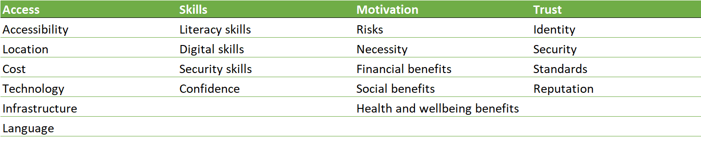

# Digital Inclusion

## Problems people suffer accessing websites

[See more detail on each of these areas](problems.md)


## Vulnerable groups
### Who are vulnerable groups
Here is a definition from: http://www.wbsb.co.uk/4482

```
Vulnerable Adult Definition
"A person who is 18 years of age or over, and who is or may be in need of community care services by reason 
of mental or other disability, age or illness and who is or may be unable to take care of him/herself, or 
unable to protect him/herself against significant harm or serious exploitation."

(Law Commission - Who Decides?: Making decisions on behalf of mentally incapacitated adults 1997)

Factors of a Vulnerable Adult:
- Is elderly and frail due to ill health, physical disability or cognitive impairment
- Has a learning disability
- Has a physical disability and / or a sensory impairment
- Has mental health needs including dementia or a personality disorder
- Has a long-term illness / condition
- Misuses substances or alcohol
- Is a carer, where the person meets the definition
- Is unable to demonstrate the capacity to make a decision and is in need of care and support.
```

#### Some other definitions
- Financialy Disadvantaged
- Language challenged
- Physically disadvantaged
- Mentally disadvantaged
- Geographically disadvantaged
- People With Criminal Records (Talk to Disclosure Scotland)
- Health issues

## Who are Marginalized and Vulnerable Populations


## Find out more about them in these places
- Linwood Development Trust (Jim...)
- Councillors - School councillors or SMP's. Mari Black
- Job centres
- Housing ?
- Skills land...
- Schools
- Colleges
- Citizens Advice
- Libraries (Older groups, IT classes, Photocopying, CV's etc...)
- Careers advisors
- Fayres - Job Fayres
- Fordbank/River Brae


