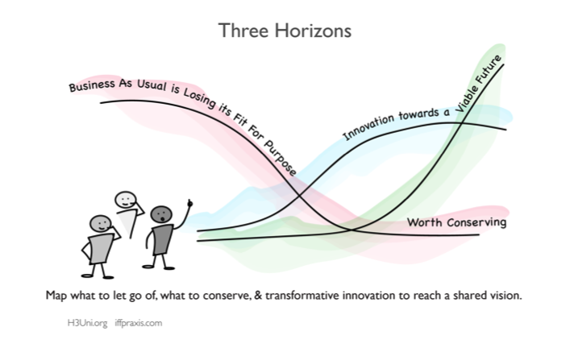

# 3 Horizons

The Three Horizons framework is a simple, intuitive way to encourage a conversation about the challenges in the present, our aspirations for the future and the kinds of innovation we might need in order to address both at the same time.  

- [Read about the 3 Horizons - by International Future Forum](https://www.iffpraxis.com/three-horizons)
- [Or by H3Uni](https://www.h3uni.org/practices/foresight-three-horizons/)
- Article about this: [Helping public institutions look beyond the curve](https://medium.com/states-of-change/helping-public-institutions-look-beyond-the-curve-a68ff2c808e9) by States of change

<iframe width="560" height="315" src="https://www.youtube.com/embed/w7V6C3580WI" frameborder="0" allow="accelerometer; autoplay; encrypted-media; gyroscope; picture-in-picture" allowfullscreen></iframe>

_[A map of the Three Horizons and how they interrelate from H3Uni](https://www.h3uni.org/practices/foresight-three-horizons/)_

