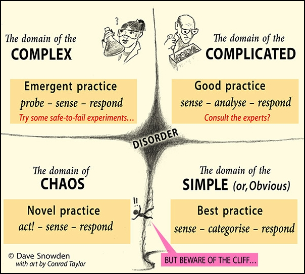

# Cynefin framework

[Cynefin® framework introduction by Dave Snowden](http://cognitive-edge.com/videos/cynefin-framework-introduction/)

Cynefin is a Welsh word (Dave Snowden is Welsh). It means approximately "The place(s) where I belong." <strong>Cynefin is a way of making sense of the world</strong>: of human organisation primarily.

 <iframe title="Dave Snowden explaining the Cynefin framework" class ="img-half-width"  width="560" height="315" src="https://www.youtube.com/embed/N7oz366X0-8" frameborder="0" allow="accelerometer; autoplay; encrypted-media; gyroscope; picture-in-picture" allowfullscreen></iframe>

This is not a model. A model seek to represent reality while a framework is a way of looking at reality. It's not about making categories but about making sense. 
  In categorisation models, Framework precedes data 
  In sense making models: data precedes framework 
  There are 5 domains, 2 ordered on the right, 2 unordered on the left and disorder in the middle 
  <strong>You need to use the appropriate method for the appropriate domain</strong>

<ul>
    <li><strong>Disorder</strong>: you don't know what type of system you're in - it's an unhappy place'</li>
    <li><strong>Simple / obvious:</strong> For problems in this domain, the relationship between cause and effect is obvious: if there is a problem, we all know how to fix it. (More recently, this domain is labelled ‘Obvious’, because Simple sounds like Easy. It may be Obvious we need to dig a tunnel through a mountain, but it’s not Easy…) Organisations define ‘best practice’ to tackle Obvious issues.</li>
    <li><strong>Complicated:</strong> In this domain, there are repeatable and predictable chains of cause and effect, but they are not so easy to discern. A jet engine is sometimes given as a metaphorical example of such complicatedness. In this domain, problem-solving often involves the knowledge of an expert, or an analytical process.</li>
    <li><strong>Chaotic: </strong>In this domain, we can’t discern a relationship between cause and effect at all, because the interacting elements are so loosely constrained. Chaos is usually a temporary condition, because a pattern will emerge, or somebody will take control and impose some sort of order. In Chaos, you don’t have time to assess carefully: decisive action is needed, in the hope that good things will emerge and can be encouraged. (And as Dave sometimes says, ‘Light candles and pray!’)</li>
    <li><strong>Complex:</strong> This is a domain in which various ‘actors and factors’ – animate and inanimate – do respond to constraints, and can be attracted to influences, but those constraints and influences are relatively elastic, and there are many interactions and feedback loops that are hard to fathom. Such a system is more like a biological or ecological system than a mechanical one. Cognitive Edge practitioners have a battery of techniques for experimentation in this space, as Tony would soon describe.</li>
    <li><strong>The cliff between Obvious and Chaos</strong>: if people act with complete blind conviction that things are really simple and obvious, and Best Practice is followed without question, the organisation can be blindsided to major changes happening in their world. One day, when you pull the levers, you don’t get the response you have come to expect, and you have a crisis on your hands. And if you simply try to re-impose the rules, it can make things worse.</li>
</ul>
 
Diagram below done by Dave Snowden,  from [Working in Complexity – SenseMaker, Decisions and Cynefin](https://netikx.wordpress.com/2018/05/23/working-in-complexity-sensemaker-decisions-and-cynefin/)

