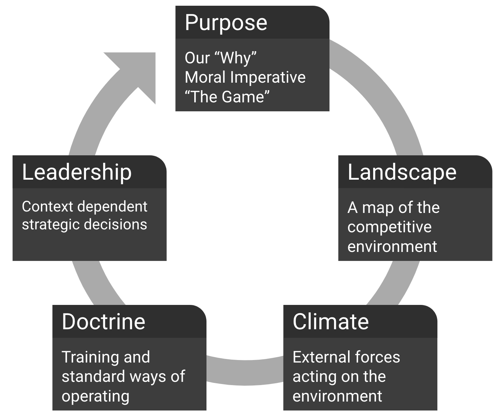

# Wardley maps

Wardley Mapping is a strategic decision-making practice. 
The mapping process holds the space for the integration of context, perspective, and creativity.

- [Learn about Warley maspping](https://learnwardleymapping.com/)
- [Miro blog post on it](https://miro.com/blog/wardley-maps-whiteboard-canvas/)

<iframe width="560" height="315" src="https://www.youtube.com/embed/Gfq3ocmadZo" frameborder="0" allow="accelerometer; autoplay; encrypted-media; gyroscope; picture-in-picture" allowfullscreen></iframe>

 
 

